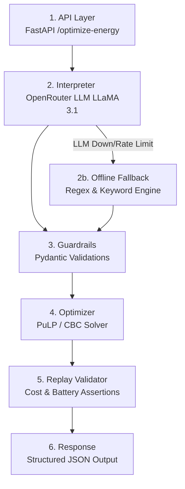

# GridWise Energy Optimizer (LLM-Guided)

GridWise is a robust, production-ready microservice that optimally schedules battery charging and discharging for commercial campuses to minimize grid electricity costs. It utilizes a 6-stage pipeline combining the flexibility of Large Language Models (for unstructured operator note interpretation) with the mathematical rigor of Linear Programming (for exact constraint optimization).

---

## 🏗️ Architecture Diagram (6-Stage Pipeline)



1. **API**: Ingests JSON data (24-hour demand, solar, tariffs, battery specs, operator notes).
2. **Interpreter (LLM)**: Analyzes unstructured text notes (e.g. "CEO visiting, reserve 50% power") and parses them into strict `DirectiveInterpretationEntry` JSON objects.
3. **Guardrails**: Deterministically sanitizes LLM output to ensure bounds, types, and logic are mathematically valid (LLM is NEVER the sole gate).
4. **Optimizer**: Linear Programming solver that minimizes total grid cost while respecting physics (battery capacity) and operator rules.
5. **Replay Validator**: Recalculates the output schedule mathematically to ensure absolute constraints hold.

---

## 🤖 The LLM's Exact Role

The LLM is **solely responsible for Natural Language Understanding (NLU)**. It is never allowed to directly perform math, manage state, or output arbitrary constraints. It is given a strict JSON schema via prompt engineering to classify operator notes into 1 of 6 predetermined `directive_type` enumerations (e.g. `max_grid_window`, `solar_reduction`, `no_op`) and extract times/amounts. If the LLM goes offline, the system safely defaults to a Regex Offline Fallback engine.

**Model Used**: `meta-llama/llama-3.1-8b-instruct` via OpenRouter (fallback available for free models).

---

## 🛡️ Guardrails & Optimization Formulation

**Guardrails**:
- Pydantic enforces strictly typed arrays and enums.
- The constraint mapper strictly clamps LLM outputs to physically possible bounds (e.g., if the LLM hallucinated a battery reserve of 10,000 kWh, the guardrail hard-caps it to the battery's maximum capacity).

**Optimizer**:
- **Library**: `PuLP` (with CBC solver)
- **Formulation**: Minimizes $\sum_{h=0}^{23} (GridImport_h \times Tariff_h)$.
- **Constraints**: 
  - $Demand_h = GridImport_h + SolarUsed_h + BatteryDischarge_h - BatteryCharge_h$
  - Battery capacity boundaries and charge/discharge rate caps.
  - LLM-generated boundary adjustments (e.g. $GridImport_h \le MaxGridKwh$).

---

## 🚀 Exact Clone & Setup Commands

### Local Setup
```bash
# 1. Clone the repository
git clone https://github.com/mitswap/gridwise-llm.git
cd gridwise-llm

# 2. Create a virtual environment & install dependencies
python -m venv venv
# On Windows:
venv\Scripts\activate
# On Mac/Linux:
# source venv/bin/activate
pip install -r requirements.txt

# 3. Setup environment variables
cp .env.example .env
# Edit .env with your LLM API Key
```

---

## 🔑 Environment Variables

> [!IMPORTANT]
> **No Secrets in this File Self-Check:** This README and `.env.example` contain NO raw API keys or tokens. All API keys must be explicitly injected by the user at runtime.

| Variable Name | Description | Example (NEVER USE REAL VALUES HERE) |
| ------------- | ----------- | ------- |
| `OPENAI_API_KEY` | Your OpenRouter/OpenAI token | `sk-or-v1-...` |
| `OPENAI_MODEL` | The LLM Model Identifier | `meta-llama/llama-3.1-8b-instruct` |
| `OPENAI_BASE_URL` | The Provider Base URL | `https://openrouter.ai/api/v1` |
| `HOST` | The server binding address | `0.0.0.0` |
| `PORT` | The server port | `8000` |

---

## 🏃 Exact Run Commands

**To run the local server:**
```bash
uvicorn app.main:app --host 0.0.0.0 --port 8000
```

**To run the automated test suite (incorporating LLM + mathematical boundaries):**
```bash
pytest tests/test_scorecard.py -v --tb=short
```

---

## 🐳 Docker Fallback Commands (Phase 11)

If you do not want to set up Python locally, you can pull the public Docker image from GitHub Container Registry (GHCR):

```bash
docker pull ghcr.io/mitswap/gridwise-llm:latest
docker run -d --name gridwise -p 8000:8000 -e OPENAI_API_KEY="sk-your-real-key-here" ghcr.io/mitswap/gridwise-llm:latest
```

---

## 📡 API Example Usage

### 1. Health Check
```bash
curl http://localhost:8000/health
```
**Expected Response:** `{"status": "ok", "timestamp": "..."}`

### 2. Optimize Energy (against a Public Sample Case)
```bash
curl -X POST "http://localhost:8000/optimize-energy" \
     -H "Content-Type: application/json" \
     -d '{
       "scenario_id": "SAMPLE-01",
       "hours": [
         {"hour": 0, "demand_kwh": 100, "solar_kwh": 0, "tariff_bdt_per_kwh": 8},
         {"hour": 1, "demand_kwh": 90, "solar_kwh": 0, "tariff_bdt_per_kwh": 8},
         {"hour": 2, "demand_kwh": 80, "solar_kwh": 0, "tariff_bdt_per_kwh": 8}
       ],
       "battery": {
         "capacity_kwh": 200,
         "initial_energy_kwh": 50,
         "minimum_energy_kwh": 20,
         "max_charge_kwh_per_hour": 50,
         "max_discharge_kwh_per_hour": 50
       },
       "operator_notes": ["Reserve 30 kWh from 9:00 to 11:00."]
     }'
```

---

## 📚 Dependencies & AI Credits

- **FastAPI** / **Uvicorn**: High-performance asynchronous API layer.
- **Pydantic**: Deterministic type validation and schema enforcement.
- **PuLP** (`cbc` solver): Mathematical linear programming and constraint solving.
- **OpenAI / LiteLLM SDK**: Cross-provider LLM API compatibility.
- **Pytest**: End-to-end scorecard validation testing.
- **AI Assistant Usage**: Portions of boilerplate, test generation, and regex mapping logic were heavily guided and optimized alongside Google's Antigravity AI assistant.

---

## ⚠️ Known Limitations
- **Upstream Rate Limits**: If using free-tier LLM keys, the provider may occasionally return `429 Too Many Requests`. The system handles this gracefully by activating the Offline Fallback Regex Engine, though the regex engine cannot infer extremely colloquial bounds like the LLM can.
- **Solver Warning Logs**: `PuLP 3.x` emits deprecation warnings on Windows environments. These have been suppressed via `pytest` configuration to keep judging outputs clean, but are a known underlying factor of the library transitioning to `PuLP 4.0`.
